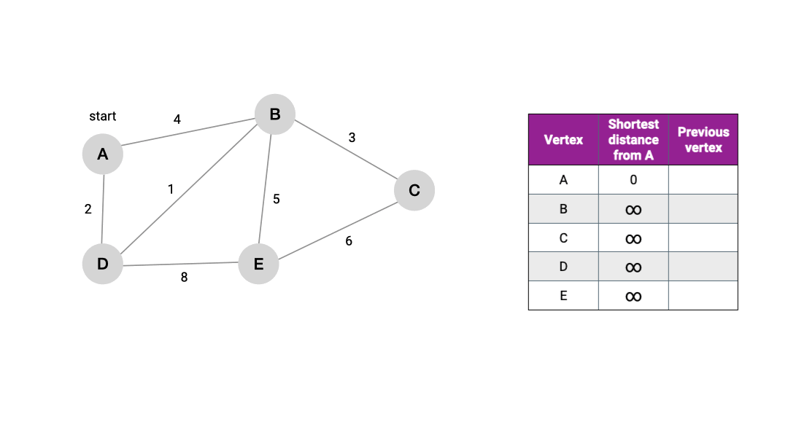
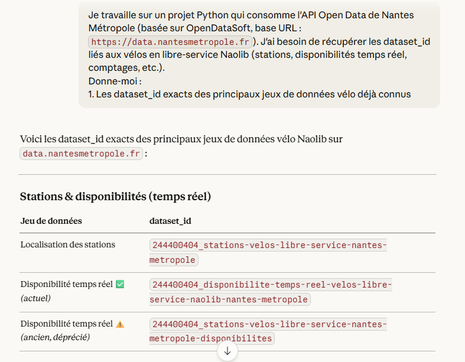

<p align="center">
  <a href="https://git.io/typing-svg"></a>
</p>

# Interactive map
**Mp6 TermD**

Dijkstra algorithm applied to a [folium](https://python-visualization.github.io/folium/latest/getting_started.html) map

**Developed by [Soka7](https://github.com/Soka7), [Yolked64](https://github.com/Yolked64)

## ✨Features

## 🚀 Infos

As it is requested to display a folium map in tkinter we're gonna use a web engine in tkinter using [webview](https://pywebview.flowrl.com/guide/) for we know that folium is generating HTML and JavaScript.

### Basics
```bash
# Install dependencies
pip install -r requirements.txt
```
[Thanks to](https://github.com/python-visualization/folium/blob/main/requirements.txt)

### Basics - dev
```bash
# Install devs dependencies
pip install -r requirements - dev.txt
```
[Thanks to](https://github.com/python-visualization/folium/blob/main/requirements-dev.txt)

### Plan
```bash
# Seeing the plan
cat plan.txt
```

### README reference
```bash
https://github.com/mhucka/readmine/blob/main/README.md?plain=1

```
# Description

# Tools/Languages
Python

# Libraries
[tkinter](https://docs.python.org/fr/3/library/tkinter.html)

[geopy](https://www.geeksforgeeks.org/python/python-calculate-distance-between-two-places-using-geopy/)

[webview](https://pywebview.flowrl.com/guide/)

# API

[NantesMetropole](https://data.nantesmetropole.fr/api/explore/v2.1/console)

----------------------------------------------------------------------------------------------------------------------------------------------



[](https://python-visualization.github.io/folium/latest/getting_started.html) [](https://docs.python.org/3/) [](https://memgraph.com/docs/advanced-algorithms/deep-path-traversal) [](https://open.spotify.com/embed/track/5Vbmq6BqLmRzzIO6fu916a?utm_source=generator) [](https://claude.ai/login?from=logout)

Utilisation de l'ia pour corriger certaines choses, mais reverification systematique <br>
Prompts sent to AIs will be written down

